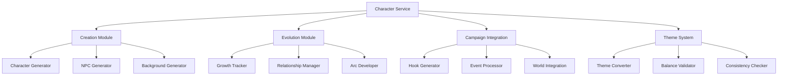

# Character Service Architecture

## Overview

The Character Service is a comprehensive system for creating, managing, and evolving D&D characters in both traditional and specialized (Antitheticon) campaigns. It handles everything from initial character creation to complex character development and campaign integration.

## Core Capabilities

### 1. Character Creation
- Generates mechanically balanced characters
- Supports multiple themes and settings
- Maintains D&D 5e rule compliance
- Creates rich backstories and personalities
- Generates NPCs and antagonists

### 2. Character Evolution
- Tracks character development
- Processes growth events
- Evolves relationships
- Integrates with campaign events
- Maintains character arcs

### 3. Campaign Integration
- Provides hooks for campaign development
- Processes campaign events
- Evolves based on world changes
- Maintains narrative consistency
- Generates story opportunities

### 4. Specialized Systems
- Antitheticon mastermind system
- Identity deception networks
- Theme-based conversion
- Balance validation
- Cross-theme consistency

## Service Architecture



## Key Components

### Character Creation Service
```json
{
    "responsibilities": [
        "Generate new characters",
        "Create NPCs",
        "Generate backgrounds",
        "Ensure rule compliance",
        "Theme integration"
    ],
    "integrations": {
        "campaign_service": "Receives campaign context",
        "theme_service": "Handles theme conversion",
        "rule_service": "Validates mechanics"
    },
    "key_methods": [
        "create_character()",
        "create_npc()",
        "generate_background()",
        "validate_character()"
    ]
}
```

### Character Evolution Service
```json
{
    "responsibilities": [
        "Track character growth",
        "Process events",
        "Manage relationships",
        "Develop character arcs",
        "Generate opportunities"
    ],
    "integrations": {
        "campaign_service": "Receives events, Provides hooks",
        "world_service": "Tracks impact",
        "story_service": "Narrative integration"
    },
    "key_methods": [
        "process_growth_event()",
        "evolve_relationship()",
        "generate_opportunities()",
        "update_character_arc()"
    ]
}
```

### Antitheticon System
```json
{
    "responsibilities": [
        "Manage mastermind identities",
        "Create deception networks",
        "Process investigations",
        "Generate revelations",
        "Maintain consistency"
    ],
    "integrations": {
        "campaign_service": "Theme coordination",
        "story_service": "Plot development",
        "world_service": "Network placement"
    },
    "key_methods": [
        "create_false_identity()",
        "manage_network()",
        "process_investigation()",
        "generate_revelation()"
    ]
}
```

## Integration Schemas

### Input Schemas

#### Character Creation Request
```json
{
    "type": "object",
    "properties": {
        "campaign_type": {
            "type": "string",
            "enum": ["traditional", "antitheticon"]
        },
        "character_type": {
            "type": "string",
            "enum": ["player", "npc", "antagonist", "mastermind"]
        },
        "theme": {
            "type": "object",
            "properties": {
                "setting": "string",
                "style": "string",
                "elements": "array"
            }
        },
        "requirements": {
            "type": "object",
            "properties": {
                "level": "integer",
                "role": "string",
                "restrictions": "array"
            }
        }
    }
}
```

#### Evolution Event
```json
{
    "type": "object",
    "properties": {
        "event_type": {
            "type": "string",
            "enum": ["moral_choice", "skill_gain", "relationship_change", "story_event"]
        },
        "character_id": "string",
        "description": "string",
        "impact": {
            "type": "object",
            "properties": {
                "immediate": "object",
                "long_term": "object"
            }
        },
        "context": "object"
    }
}
```

### Output Schemas

#### Character Data
```json
{
    "type": "object",
    "properties": {
        "character_id": "string",
        "base_data": {
            "type": "object",
            "properties": {
                "stats": "object",
                "abilities": "array",
                "background": "object"
            }
        },
        "narrative_elements": {
            "type": "object",
            "properties": {
                "personality": "object",
                "relationships": "array",
                "goals": "array"
            }
        },
        "campaign_integration": {
            "type": "object",
            "properties": {
                "hooks": "array",
                "plot_points": "array",
                "world_connections": "array"
            }
        }
    }
}
```

#### Evolution Response
```json
{
    "type": "object",
    "properties": {
        "character_updates": {
            "type": "object",
            "properties": {
                "stat_changes": "object",
                "narrative_changes": "object",
                "relationship_updates": "array"
            }
        },
        "story_implications": {
            "type": "object",
            "properties": {
                "immediate": "array",
                "future": "array",
                "hooks": "array"
            }
        },
        "world_effects": {
            "type": "object",
            "properties": {
                "immediate": "array",
                "long_term": "array"
            }
        }
    }
}
```

## External Service Integration

### Campaign Service
- Receives campaign context and events
- Provides character-driven hooks and developments
- Coordinates theme transitions
- Manages narrative consistency

### World Service
- Tracks character impact on world
- Provides world context for development
- Manages relationship networks
- Coordinates cross-character effects

### Theme Service
- Handles theme conversion
- Validates mechanical balance
- Ensures theme consistency
- Manages theme-specific elements

### Story Service
- Integrates character arcs into narrative
- Generates character-driven plot points
- Manages relationship developments
- Coordinates dramatic moments

## Development Guidelines

1. Maintain Rule Compliance
   - All mechanical changes must comply with D&D 5e rules
   - Theme conversions must preserve game balance
   - Character capabilities must remain consistent

2. Ensure Narrative Consistency
   - Character development should follow established arcs
   - Relationships should evolve naturally
   - Story elements should build on history

3. Support Campaign Integration
   - Generate useful hooks for DMs
   - Provide meaningful character development
   - Enable dynamic story evolution

4. Enable Theme Flexibility
   - Support multiple campaign styles
   - Allow seamless theme conversion
   - Maintain mechanical balance

5. Preserve Character Identity
   - Keep development consistent with background
   - Maintain personality traits
   - Honor character goals and motivations

## Usage Examples

See the following files for detailed examples:
- `/examples/character_creation.py`
- `/examples/character_evolution.py`
- `/examples/antitheticon_example.py`
- `/examples/theme_conversion.py`

## Testing Guidelines

1. Mechanical Validation
   - Test rule compliance
   - Verify balance maintenance
   - Check theme conversion accuracy

2. Narrative Testing
   - Verify character consistency
   - Test relationship evolution
   - Check story integration

3. Integration Testing
   - Test service interactions
   - Verify data flow
   - Check error handling

4. Theme Testing
   - Verify theme conversion
   - Test balance preservation
   - Check consistency maintenance
