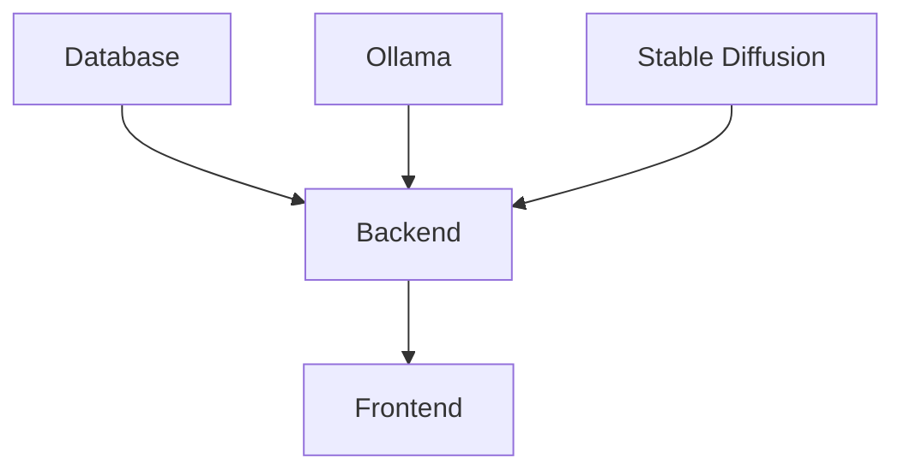

# D&D Character Creator - Deployment Guide

This directory contains all deployment configurations and scripts for the D&D Character Creator application, standardized to use **Podman** instead of Docker.

## 🏗️ Architecture Overview

```
┌─────────────────────────────────────────────────────────────┐
│                 podman-compose.yml (ROOT)                   │
│                   Full Stack Orchestration                  │
├─────────────────┬─────────────────┬─────────────────────────┤
│   Frontend      │    Backend      │      AI Services        │
│   (React)       │   (FastAPI)     │                         │
│   Port 3000     │   Port 8000     │   ├─ Ollama (11434)    │
│                 │                 │   └─ Stable Diff (7860) │
└─────────────────┴─────────────────┴─────────────────────────┘
                           │
                  ┌────────┴─────────┐
                  │    Database      │
                  │  (PostgreSQL)    │
                  │   Port 5432      │
                  └──────────────────┘
```

## 📁 Directory Structure

```
deployment/
├── scripts/           # All deployment and management scripts
│   ├── setup-full.sh          # Complete application setup
│   ├── setup-backend-dev.sh   # Backend development setup
│   ├── cleanup.sh             # Clean up old containers/images
│   ├── setup-original.sh      # Original setup script (archived)
│   └── deploy-original.sh     # Original deploy script (archived)
└── compose/           # Compose files for different environments
    └── backend-dev.yml        # Backend-only development environment
```

## 🚀 Quick Start

### Full Application (All Services)

```bash
# Run the full application stack
./deployment/scripts/setup-full.sh

# Services will be available at:
# - Frontend:  http://localhost:3000
# - Backend:   http://localhost:8000
# - API Docs:  http://localhost:8000/docs
# - Ollama:    http://localhost:11434
```

### Backend Development Only

```bash
# Run only backend services (API + Database + LLM)
./deployment/scripts/setup-backend-dev.sh

# Services will be available at:
# - Backend:   http://localhost:8000
# - API Docs:  http://localhost:8000/docs
# - Ollama:    http://localhost:11434
# - Database:  localhost:5432
```

## 🔧 Configuration

### Environment Variables

Create a `.env` file in the project root:

```bash
# Database Configuration
DB_PASSWORD=your_secure_password

# API Configuration
SECRET_KEY=your_secret_key

# LLM Configuration
LLM_PROVIDER=ollama
LLM_MODEL=llama3:8b

# Debug Configuration
DEBUG=false
LOG_LEVEL=INFO

# CORS Configuration
CORS_ORIGINS=http://localhost:3000

# External API Keys (optional)
OPENAI_API_KEY=your_openai_key_here
ANTHROPIC_API_KEY=your_anthropic_key_here
```

### LLM Provider Options

1. **Ollama (Default)** - Local LLM service
   ```bash
   LLM_PROVIDER=ollama
   LLM_MODEL=llama3:8b
   ```

2. **OpenAI** - Cloud service
   ```bash
   LLM_PROVIDER=openai
   OPENAI_API_KEY=your_key
   ```

3. **Anthropic** - Claude AI
   ```bash
   LLM_PROVIDER=anthropic
   ANTHROPIC_API_KEY=your_key
   ```

## 🛠️ Management Commands

### Full Stack Management

```bash
# View all service logs
podman-compose -f podman-compose.yml logs -f

# Stop all services
podman-compose -f podman-compose.yml down

# Restart specific service
podman-compose -f podman-compose.yml restart backend

# Check service status
podman-compose -f podman-compose.yml ps
```

### Backend Development Management

```bash
# Navigate to backend directory first
cd backend

# View backend logs
podman-compose -f ../deployment/compose/backend-dev.yml logs -f backend

# Stop backend services
podman-compose -f ../deployment/compose/backend-dev.yml down

# Restart backend services
podman-compose -f ../deployment/compose/backend-dev.yml restart

# Access backend container shell
podman exec -it dnd_character_api_dev /bin/bash
```

## 🧪 Testing & Development

### Backend Testing

```bash
# Run tests inside container
podman exec dnd_character_api_dev python -m pytest

# Run specific test file
podman exec dnd_character_api_dev python -m pytest test_character_creation.py -v

# Check API health
curl http://localhost:8000/health
```

### Database Access

```bash
# Connect to database (full stack)
psql -h localhost -p 5432 -U dnd_user -d dnd_characters

# Connect to database (development)
podman exec -it dnd_character_db_dev psql -U dnd_user -d dnd_characters
```

### LLM Testing

```bash
# Test Ollama service
curl http://localhost:11434/api/version

# Test chat completion
curl -X POST http://localhost:11434/api/chat \
  -H "Content-Type: application/json" \
  -d '{
    "model": "llama3:8b",
    "messages": [{"role": "user", "content": "Hello"}]
  }'
```

## 🔧 Troubleshooting

### Common Issues

1. **Port Already in Use**
   ```bash
   # Check what's using the port
   sudo netstat -tulpn | grep :8000
   
   # Kill the process
   sudo kill -9 <PID>
   ```

2. **Permission Denied**
   ```bash
   # Fix script permissions
   chmod +x deployment/scripts/*.sh
   ```

3. **GPU Not Available**
   - Ollama and Stable Diffusion require NVIDIA GPU
   - Edit compose files to remove GPU requirements if needed

4. **Database Connection Issues**
   ```bash
   # Check database logs
   podman logs dnd_character_db
   
   # Reset database
   podman-compose down -v
   podman-compose up -d
   ```

### Service Dependencies



## 🔒 Security Notes

1. **Change Default Passwords**: Always change default passwords in production
2. **API Keys**: Store API keys securely using environment variables
3. **CORS**: Configure CORS appropriately for your environment
4. **Secrets**: Use Podman secrets for sensitive data

## 📝 Migration from Docker

If you're migrating from the old Docker setup:

1. Run the cleanup script: `./deployment/scripts/cleanup.sh`
2. Install Podman and podman-compose
3. Run the new setup: `./deployment/scripts/setup-full.sh`

## 🆘 Support

For issues and questions:

1. Check the logs: `podman-compose logs -f`
2. Verify service health: `podman-compose ps`
3. Test individual services using the curl commands above
4. Check the main README.md for application-specific documentation
