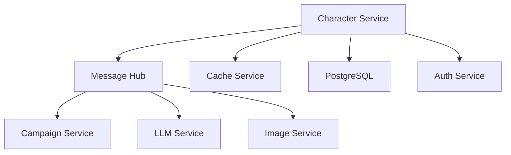

# Character Service Implementation Guide

Version: 2.0.0  
Status: Active  
Last Updated: 2025-09-07

## Table of Contents

1. [Architecture Overview](#architecture-overview)
2. [Component Interaction](#component-interaction)
3. [Core Components](#core-components)
4. [Extension Points](#extension-points)
5. [Development Patterns](#development-patterns)
6. [Best Practices](#best-practices)
7. [Common Workflows](#common-workflows)
8. [Testing Strategy](#testing-strategy)
9. [Performance Optimization](#performance-optimization)
10. [Security Considerations](#security-considerations)

## Architecture Overview

The Character Service follows Clean Architecture principles with clear separation of concerns across multiple layers:

```
┌────────────────────────────────────────────────┐
│              Presentation Layer                 │
│  ┌──────────────────────────────────────────┐  │
│  │  FastAPI Routers & Controllers           │  │
│  │  - Request/Response Models (Pydantic)    │  │
│  │  - OpenAPI Documentation                 │  │
│  │  - Authentication/Authorization          │  │
│  └──────────────────────────────────────────┘  │
└────────────────────────────────────────────────┘
                        ↓
┌────────────────────────────────────────────────┐
│              Application Layer                  │
│  ┌──────────────────────────────────────────┐  │
│  │  Use Cases & Service Orchestration       │  │
│  │  - CharacterService                      │  │
│  │  - ValidationService                     │  │
│  │  - ThemeService                          │  │
│  │  - InventoryService                      │  │
│  └──────────────────────────────────────────┘  │
└────────────────────────────────────────────────┘
                        ↓
┌────────────────────────────────────────────────┐
│                Domain Layer                     │
│  ┌──────────────────────────────────────────┐  │
│  │  Business Logic & Domain Models          │  │
│  │  - Character Entity                      │  │
│  │  - Validation Rules                      │  │
│  │  - Theme Transitions                     │  │
│  │  - Inventory Management                  │  │
│  └──────────────────────────────────────────┘  │
└────────────────────────────────────────────────┘
                        ↓
┌────────────────────────────────────────────────┐
│             Infrastructure Layer                │
│  ┌──────────────────────────────────────────┐  │
│  │  External Systems & Data Access          │  │
│  │  - Database (PostgreSQL)                 │  │
│  │  - Cache (Redis)                         │  │
│  │  - Message Hub                           │  │
│  │  - External Services                     │  │
│  └──────────────────────────────────────────┘  │
└────────────────────────────────────────────────┘
```

### Directory Structure

```
services/character/
├── src/
│   ├── api/                 # Presentation layer
│   │   ├── routers/         # FastAPI routers
│   │   ├── schemas/         # Pydantic models
│   │   └── middleware/      # Request middleware
│   ├── core/                # Application configuration
│   │   ├── config.py        # Service configuration
│   │   ├── exceptions.py    # Custom exceptions
│   │   └── monitoring.py    # Metrics/monitoring
│   ├── domain/              # Domain layer
│   │   ├── models/          # Domain entities
│   │   ├── services/        # Domain services
│   │   └── validation/      # Business rules
│   ├── infrastructure/      # Infrastructure layer
│   │   ├── database/        # Database access
│   │   ├── cache/           # Cache integration
│   │   └── clients/         # External clients
│   └── main.py             # Application entry point
├── tests/                   # Test suites
├── migrations/              # Database migrations
└── docs/                    # Documentation
```

## Component Interaction

### Service Dependencies



### Event Flow

1. **Inbound Events** - Received via Message Hub subscriptions
2. **Processing** - Business logic execution
3. **State Management** - Database and cache updates
4. **Outbound Events** - Published to Message Hub

### Data Flow Pattern

```python
# Request → Router → Service → Repository → Database
# Response ← Router ← Service ← Repository ← Database

@router.post("/characters")
async def create_character(request: CharacterCreate):
    # 1. Validate request
    validated_data = await validate_request(request)
    
    # 2. Execute business logic
    character = await character_service.create(validated_data)
    
    # 3. Publish event
    await message_hub.publish("character.created", character)
    
    # 4. Return response
    return CharacterResponse.from_domain(character)
```

## Core Components

### 1. Character Management

```python
class CharacterService:
    """Core character management service"""
    
    async def create(self, data: CharacterCreate) -> Character:
        # Validation
        await self.validator.validate(data)
        
        # Business logic
        character = Character.from_creation_data(data)
        
        # Theme application
        if data.theme:
            character = await self.theme_service.apply(character, data.theme)
        
        # Persistence
        saved = await self.repository.save(character)
        
        # Event publishing
        await self.event_publisher.publish("character.created", saved)
        
        return saved
```

### 2. Validation System

```python
class ValidationService:
    """Comprehensive validation framework"""
    
    def __init__(self):
        self.rules = RuleRegistry()
        self.cache = ValidationCache()
    
    async def validate(self, character: Character) -> ValidationResult:
        # Check cache
        cached = await self.cache.get(character.id)
        if cached and not character.is_modified:
            return cached
        
        # Execute rules
        result = await self.execute_rules(character)
        
        # Cache result
        await self.cache.set(character.id, result)
        
        return result
```

### 3. Theme System

```python
class ThemeService:
    """Theme management and transitions"""
    
    async def transition(
        self,
        character: Character,
        new_theme: Theme,
        context: TransitionContext
    ) -> Character:
        # Validate transition
        if not await self.can_transition(character, new_theme):
            raise InvalidTransitionError()
        
        # Apply transformations
        transformed = await self.apply_transformations(
            character, 
            new_theme,
            context
        )
        
        # Track history
        await self.history_service.record_transition(
            character.id,
            character.theme,
            new_theme
        )
        
        return transformed
```

### 4. Version Control

```python
class VersionManager:
    """Git-like version control for characters"""
    
    async def create_version(
        self,
        character: Character,
        message: str
    ) -> CharacterVersion:
        # Compute diff
        diff = await self.compute_diff(character)
        
        # Create version
        version = CharacterVersion(
            character_id=character.id,
            changes=diff,
            message=message,
            timestamp=datetime.utcnow()
        )
        
        # Save version
        await self.repository.save_version(version)
        
        return version
```

## Extension Points

### 1. Custom Validation Rules

```python
from domain.validation import ValidationRule, register_rule

@register_rule("custom_ability_check")
class CustomAbilityRule(ValidationRule):
    """Example custom validation rule"""
    
    def validate(self, character: Character) -> ValidationResult:
        # Custom validation logic
        if character.abilities.strength > 20:
            return ValidationResult.error(
                "Strength cannot exceed 20",
                field="abilities.strength",
                suggestion="Set strength to 20 or lower"
            )
        return ValidationResult.success()
```

### 2. Theme Extensions

```python
from domain.themes import ThemeTransition, register_transition

@register_transition("custom_theme")
class CustomThemeTransition(ThemeTransition):
    """Example custom theme transition"""
    
    async def apply(self, character: Character) -> Character:
        # Custom transformation logic
        character.add_feature("custom_feature")
        character.modify_ability("wisdom", +2)
        return character
```

### 3. Event Handlers

```python
from infrastructure.events import subscribe

@subscribe("campaign.milestone_reached")
async def handle_milestone(event: dict):
    """Handle campaign milestone events"""
    character_id = event["character_id"]
    milestone = event["milestone"]
    
    # Process milestone
    character = await character_repository.get(character_id)
    character.add_achievement(milestone)
    await character_repository.save(character)
```

### 4. Custom Content Types

```python
from domain.models import CustomContent, register_content

@register_content("homebrew_class")
class HomebrewClass(CustomContent):
    """Example custom content type"""
    
    name: str
    features: List[Feature]
    progression: Dict[int, List[str]]
    
    def validate(self) -> bool:
        # Custom validation logic
        return len(self.features) > 0
```

## Development Patterns

### 1. Repository Pattern

```python
class CharacterRepository:
    """Data access abstraction"""
    
    def __init__(self, db: AsyncSession):
        self.db = db
    
    async def get(self, id: UUID) -> Optional[Character]:
        query = select(CharacterModel).where(
            CharacterModel.id == id,
            CharacterModel.is_deleted == False
        )
        result = await self.db.execute(query)
        model = result.scalar_one_or_none()
        return Character.from_model(model) if model else None
```

### 2. Factory Pattern

```python
class CharacterFactory:
    """Character creation factory"""
    
    @staticmethod
    def create_fighter() -> Character:
        return Character(
            class_name="Fighter",
            hit_dice="d10",
            primary_ability="Strength",
            saves=["Strength", "Constitution"]
        )
    
    @staticmethod
    def create_wizard() -> Character:
        return Character(
            class_name="Wizard",
            hit_dice="d6",
            primary_ability="Intelligence",
            saves=["Intelligence", "Wisdom"]
        )
```

### 3. Strategy Pattern

```python
class ValidationStrategy(ABC):
    """Abstract validation strategy"""
    
    @abstractmethod
    async def validate(self, character: Character) -> ValidationResult:
        pass

class StandardValidation(ValidationStrategy):
    async def validate(self, character: Character) -> ValidationResult:
        # Standard D&D 5e validation
        pass

class CustomValidation(ValidationStrategy):
    async def validate(self, character: Character) -> ValidationResult:
        # Custom campaign validation
        pass
```

### 4. Observer Pattern

```python
class CharacterObserver:
    """Event-driven state observation"""
    
    def __init__(self):
        self.observers = []
    
    def attach(self, observer: Callable):
        self.observers.append(observer)
    
    async def notify(self, event: str, data: dict):
        for observer in self.observers:
            await observer(event, data)
```

## Best Practices

### 1. Error Handling

```python
# Use custom exceptions with context
class CharacterValidationError(ServiceException):
    def __init__(self, character_id: UUID, errors: List[str]):
        self.character_id = character_id
        self.errors = errors
        super().__init__(f"Validation failed for character {character_id}")

# Handle errors gracefully
try:
    character = await character_service.create(data)
except CharacterValidationError as e:
    logger.error(f"Validation failed: {e.errors}")
    return JSONResponse(
        status_code=400,
        content={"errors": e.errors}
    )
```

### 2. Async/Await Patterns

```python
# Use async context managers
async with db_session() as session:
    repository = CharacterRepository(session)
    character = await repository.get(character_id)

# Batch async operations
characters = await asyncio.gather(
    *[repository.get(id) for id in character_ids]
)

# Handle timeouts
try:
    async with asyncio.timeout(30):
        result = await long_running_operation()
except asyncio.TimeoutError:
    logger.error("Operation timed out")
```

### 3. Caching Strategy

```python
# Cache with TTL
@cache(ttl=3600)
async def get_character_stats(character_id: UUID):
    return await calculate_stats(character_id)

# Invalidate on update
async def update_character(character_id: UUID, data: dict):
    result = await repository.update(character_id, data)
    await cache.delete(f"stats:{character_id}")
    return result
```

### 4. Logging

```python
# Structured logging with context
logger.info(
    "Character created",
    extra={
        "character_id": character.id,
        "class": character.class_name,
        "level": character.level,
        "user_id": user_id,
        "duration_ms": elapsed_time
    }
)

# Log levels appropriately
logger.debug("Validation rule executed", extra={"rule": rule_name})
logger.info("Character transition completed", extra={"theme": theme})
logger.warning("Validation issue found", extra={"issue": issue})
logger.error("Database connection failed", exc_info=True)
```

### 5. Testing

```python
# Use fixtures for common setup
@pytest.fixture
async def character():
    return CharacterFactory.create_fighter()

# Test async functions
@pytest.mark.asyncio
async def test_character_creation(character_service):
    result = await character_service.create(test_data)
    assert result.id is not None

# Mock external dependencies
@patch("infrastructure.clients.message_hub")
async def test_event_publishing(mock_hub):
    await service.create_character(data)
    mock_hub.publish.assert_called_once()
```

## Common Workflows

### 1. Character Creation Workflow

```python
async def create_character_workflow(data: CharacterCreate) -> Character:
    # 1. Validate input
    validation_result = await validator.validate_creation(data)
    if not validation_result.is_valid:
        raise ValidationError(validation_result.errors)
    
    # 2. Generate with LLM if needed
    if data.use_ai_generation:
        enhanced_data = await llm_service.enhance_character(data)
        data = data.merge(enhanced_data)
    
    # 3. Create character
    character = Character.from_creation_data(data)
    
    # 4. Apply theme
    if data.campaign_id:
        campaign = await campaign_service.get(data.campaign_id)
        character = await theme_service.apply(character, campaign.theme)
    
    # 5. Save to database
    saved = await repository.save(character)
    
    # 6. Cache frequently accessed data
    await cache.set(f"character:{saved.id}", saved)
    
    # 7. Publish event
    await message_hub.publish("character.created", {
        "character_id": saved.id,
        "campaign_id": data.campaign_id
    })
    
    return saved
```

### 2. Theme Transition Workflow

```python
async def transition_theme_workflow(
    character_id: UUID,
    new_theme: str,
    context: dict
) -> Character:
    # 1. Get current state
    character = await repository.get(character_id)
    if not character:
        raise NotFoundError(f"Character {character_id} not found")
    
    # 2. Create version snapshot
    version = await version_manager.create_snapshot(character)
    
    # 3. Validate transition
    can_transition = await theme_service.validate_transition(
        character, 
        new_theme
    )
    if not can_transition:
        raise InvalidTransitionError()
    
    # 4. Apply transition
    try:
        transformed = await theme_service.apply_transition(
            character,
            new_theme,
            context
        )
    except Exception as e:
        # Rollback on failure
        await version_manager.restore(version)
        raise
    
    # 5. Save changes
    saved = await repository.save(transformed)
    
    # 6. Update cache
    await cache.delete(f"character:{character_id}")
    
    # 7. Publish event
    await message_hub.publish("character.theme_changed", {
        "character_id": character_id,
        "old_theme": character.theme,
        "new_theme": new_theme
    })
    
    return saved
```

### 3. Bulk Validation Workflow

```python
async def bulk_validate_workflow(
    character_ids: List[UUID]
) -> Dict[UUID, ValidationResult]:
    # 1. Batch fetch characters
    characters = await repository.get_many(character_ids)
    
    # 2. Check cache for existing results
    cache_keys = [f"validation:{id}" for id in character_ids]
    cached_results = await cache.get_many(cache_keys)
    
    # 3. Validate uncached characters
    tasks = []
    for char in characters:
        if f"validation:{char.id}" not in cached_results:
            tasks.append(validator.validate(char))
    
    # 4. Execute validations in parallel
    if tasks:
        new_results = await asyncio.gather(*tasks)
        
        # 5. Cache new results
        cache_updates = {}
        for char, result in zip(characters, new_results):
            cache_updates[f"validation:{char.id}"] = result
        await cache.set_many(cache_updates, ttl=3600)
    
    # 6. Combine results
    all_results = {**cached_results}
    all_results.update(cache_updates)
    
    return all_results
```

## Testing Strategy

### 1. Unit Tests

Test individual components in isolation:

```python
# Test domain logic
async def test_character_level_up():
    character = Character(level=1)
    character.add_experience(300)
    assert character.level == 2

# Test validation rules
async def test_ability_score_validation():
    rule = AbilityScoreRule()
    character = Character(strength=25)
    result = rule.validate(character)
    assert not result.is_valid
```

### 2. Integration Tests

Test component interactions:

```python
# Test service integration
async def test_character_creation_flow():
    async with TestDatabase() as db:
        service = CharacterService(db)
        character = await service.create(test_data)
        
        # Verify database
        saved = await db.get(character.id)
        assert saved is not None
        
        # Verify events
        events = await message_hub.get_events()
        assert "character.created" in events
```

### 3. End-to-End Tests

Test complete workflows:

```python
# Test API endpoints
async def test_api_character_workflow():
    async with TestClient(app) as client:
        # Create character
        response = await client.post("/characters", json=creation_data)
        assert response.status_code == 201
        character_id = response.json()["id"]
        
        # Apply theme
        response = await client.put(
            f"/characters/{character_id}/theme",
            json={"theme": "dark_fantasy"}
        )
        assert response.status_code == 200
        
        # Validate
        response = await client.post(
            f"/characters/{character_id}/validate"
        )
        assert response.json()["is_valid"]
```

### 4. Performance Tests

```python
# Load testing with Locust
class CharacterServiceUser(HttpUser):
    @task
    def create_character(self):
        self.client.post("/characters", json=generate_character())
    
    @task
    def get_character(self):
        self.client.get(f"/characters/{random_character_id()}")
```

## Performance Optimization

### 1. Database Optimization

```python
# Use eager loading for related data
query = select(Character).options(
    selectinload(Character.inventory),
    selectinload(Character.spells)
)

# Use indexes for frequent queries
class Character(Base):
    __tablename__ = "characters"
    __table_args__ = (
        Index("idx_character_campaign", "campaign_id"),
        Index("idx_character_user", "user_id"),
        Index("idx_character_level", "level")
    )
```

### 2. Caching Strategies

```python
# Multi-level caching
class CacheManager:
    def __init__(self):
        self.local = {}  # In-memory cache
        self.redis = Redis()  # Distributed cache
    
    async def get(self, key: str):
        # Check local first
        if key in self.local:
            return self.local[key]
        
        # Check Redis
        value = await self.redis.get(key)
        if value:
            self.local[key] = value  # Populate local
        
        return value
```

### 3. Async Optimization

```python
# Batch operations
async def get_multiple_characters(ids: List[UUID]):
    # Single query instead of N queries
    query = select(Character).where(Character.id.in_(ids))
    result = await db.execute(query)
    return result.scalars().all()

# Concurrent processing
async def process_characters(characters: List[Character]):
    tasks = [process_single(char) for char in characters]
    return await asyncio.gather(*tasks)
```

### 4. Resource Management

```python
# Connection pooling
engine = create_async_engine(
    DATABASE_URL,
    pool_size=20,
    max_overflow=40,
    pool_timeout=30,
    pool_recycle=3600
)

# Resource cleanup
@contextmanager
async def managed_resource():
    resource = await acquire_resource()
    try:
        yield resource
    finally:
        await resource.close()
```

## Security Considerations

### 1. Input Validation

```python
# Validate all inputs
class CharacterCreate(BaseModel):
    name: constr(min_length=1, max_length=100)
    level: conint(ge=1, le=20)
    class_name: str
    
    @validator("class_name")
    def validate_class(cls, v):
        if v not in VALID_CLASSES:
            raise ValueError(f"Invalid class: {v}")
        return v
```

### 2. Authorization

```python
# Check permissions
async def update_character(
    character_id: UUID,
    user: User,
    data: dict
):
    character = await repository.get(character_id)
    
    # Verify ownership
    if character.user_id != user.id:
        # Check for special permissions
        if not user.has_permission("admin"):
            raise PermissionDeniedError()
    
    return await repository.update(character_id, data)
```

### 3. Data Sanitization

```python
# Sanitize user content
def sanitize_html(content: str) -> str:
    """Remove potentially dangerous HTML"""
    allowed_tags = ["p", "b", "i", "em", "strong"]
    return bleach.clean(content, tags=allowed_tags)

# Prevent SQL injection (using ORM)
query = select(Character).where(
    Character.name == bindparam("name")
)
result = await db.execute(query, {"name": user_input})
```

### 4. Rate Limiting

```python
from fastapi_limiter import FastAPILimiter
from fastapi_limiter.depends import RateLimiter

@router.post(
    "/characters",
    dependencies=[Depends(RateLimiter(times=10, seconds=60))]
)
async def create_character(data: CharacterCreate):
    # Limited to 10 requests per minute
    pass
```

### 5. Audit Logging

```python
# Log security events
async def log_security_event(
    event_type: str,
    user_id: UUID,
    details: dict
):
    await audit_log.create({
        "event_type": event_type,
        "user_id": user_id,
        "timestamp": datetime.utcnow(),
        "details": details,
        "ip_address": request.client.host
    })
```

## Troubleshooting Guide

### Common Issues

1. **High Memory Usage**
   - Check for memory leaks in cache
   - Review query result sizes
   - Monitor connection pool size

2. **Slow Queries**
   - Add appropriate indexes
   - Use query optimization
   - Implement pagination

3. **Cache Inconsistency**
   - Verify cache invalidation
   - Check TTL settings
   - Monitor cache hit rates

4. **Event Processing Delays**
   - Check Message Hub health
   - Monitor event queue size
   - Review handler performance

## Additional Resources

- [FastAPI Documentation](https://fastapi.tiangolo.com/)
- [SQLAlchemy Async Documentation](https://docs.sqlalchemy.org/en/14/orm/extensions/asyncio.html)
- [Pydantic Documentation](https://pydantic-docs.helpmanual.io/)
- [D&D 5e SRD](https://www.dndbeyond.com/sources/basic-rules)
- [Clean Architecture Principles](https://blog.cleancoder.com/uncle-bob/2012/08/13/the-clean-architecture.html)

## Version History

- **2.0.0** (2025-09-07): Complete implementation guide with all sections
- **1.0.0** (2025-08-31): Initial guide structure

---

For questions or contributions, please refer to the project's main WARP.md document.
