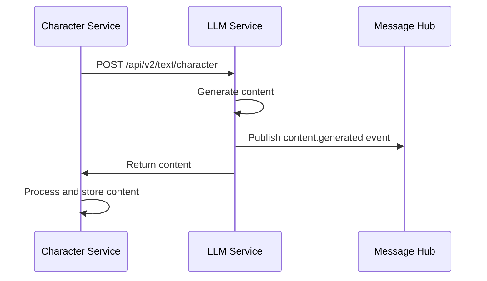
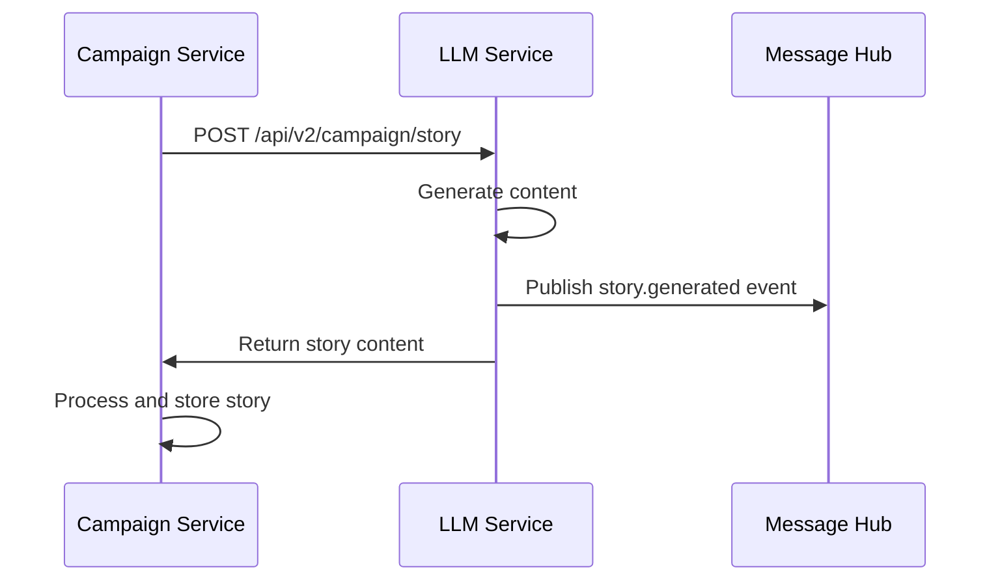
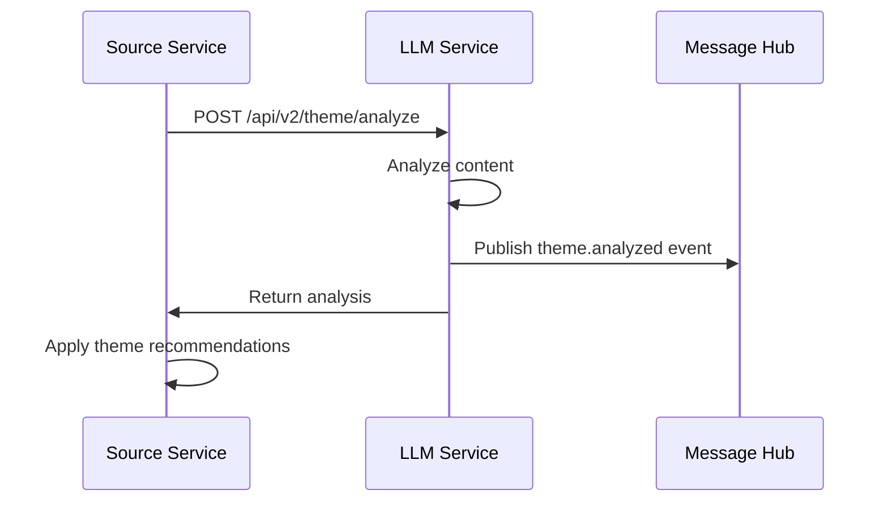

# LLM Service Integration Guide

This guide provides instructions for integrating with the LLM Service in the D&D Character Creator system.

## Overview

The LLM Service provides AI-powered text generation and content validation capabilities through a RESTful API. The service is designed to integrate with other services in the D&D Character Creator ecosystem, particularly the Character Service and Campaign Service.

## Authentication

All requests to the LLM Service must include a valid JWT token in the Authorization header:

```http
Authorization: Bearer <token>
```

### Token Requirements
- Tokens are issued by the Auth Service
- Tokens must be valid and not expired
- Tokens must include appropriate permissions

## Rate Limiting

The service implements rate limiting at multiple levels:

1. **Model-specific limits**
   - GPT-4-turbo: 200 requests/minute
   - GPT-3.5-turbo: 500 requests/minute

2. **Operation-specific limits**
   - Text generation: 100 requests/minute
   - Theme analysis: 50 requests/minute
   - Content validation: 100 requests/minute

3. **Global limits**
   - 1000 requests/minute per user
   - 10,000 requests/minute global service limit

### Rate Limit Headers
Rate limit information is included in response headers:
```http
X-RateLimit-Limit: 100
X-RateLimit-Remaining: 95
X-RateLimit-Reset: 1623456789
```

## Integration Patterns

### 1. Character Service Integration

Character content generation follows this pattern:



### 2. Campaign Service Integration

Campaign content generation pattern:



### 3. Theme Integration

Theme consistency validation pattern:



## Error Handling

### 1. Rate Limit Errors (429)
- Implement exponential backoff
- Cache successful responses
- Monitor rate limit headers

```python
async def make_request_with_backoff(request_func):
    max_retries = 3
    base_delay = 1  # second

    for attempt in range(max_retries):
        try:
            return await request_func()
        except RateLimitError:
            if attempt == max_retries - 1:
                raise
            delay = base_delay * (2 ** attempt)
            await asyncio.sleep(delay)
```

### 2. Validation Errors (400)
- Validate request parameters
- Check content length limits
- Verify theme consistency

### 3. Service Errors (500)
- Implement circuit breakers
- Log errors for investigation
- Fall back to simpler content when appropriate

## Best Practices

1. **Content Generation**
   - Cache frequently requested content
   - Reuse similar content where appropriate
   - Validate content before saving

2. **Theme Management**
   - Maintain theme consistency across content
   - Use theme analysis for transitions
   - Cache theme validation results

3. **Performance**
   - Batch related requests when possible
   - Cache responses appropriate to use case
   - Monitor rate limits and token usage

4. **Error Handling**
   - Implement proper retries
   - Log errors with context
   - Handle rate limits gracefully

## Monitoring

### 1. Metrics to Monitor
- Request success/failure rates
- Response times
- Rate limit status
- Token usage by model
- Cache hit rates

### 2. Health Checks
- Regular API health checks
- Model availability monitoring
- Rate limit headroom
- Cache health

### 3. Alerting
- Rate limit approaching threshold
- Elevated error rates
- Service degradation
- Token usage spikes

## Example Implementations

### Character Content Generation

```python
async def generate_character_content(
    character_context: dict,
    theme: dict
) -> dict:
    try:
        # Prepare request
        request = {
            "type": "backstory",
            "character_context": character_context,
            "theme": theme,
            "model": {
                "name": "gpt-4-turbo",
                "temperature": 0.7
            }
        }

        # Make request with retries
        async with httpx.AsyncClient() as client:
            response = await make_request_with_backoff(
                lambda: client.post(
                    f"{LLM_SERVICE_URL}/api/v2/text/character",
                    json=request,
                    headers={"Authorization": f"Bearer {token}"}
                )
            )

            if response.status_code == 200:
                return response.json()
            
            # Handle other status codes
            handle_error_response(response)

    except Exception as e:
        logger.error(
            "character_content_generation_failed",
            error=str(e),
            character_context=character_context
        )
        raise
```

### Theme Analysis

```python
async def validate_theme_consistency(
    content: str,
    current_theme: dict,
    target_theme: dict
) -> dict:
    try:
        # Prepare request
        request = {
            "content": content,
            "current_theme": current_theme,
            "target_theme": target_theme,
            "elements": [
                "tone",
                "mood",
                "setting",
                "character_focus"
            ]
        }

        # Make request with retries
        async with httpx.AsyncClient() as client:
            response = await make_request_with_backoff(
                lambda: client.post(
                    f"{LLM_SERVICE_URL}/api/v2/theme/analyze",
                    json=request,
                    headers={"Authorization": f"Bearer {token}"}
                )
            )

            if response.status_code == 200:
                return response.json()
            
            # Handle other status codes
            handle_error_response(response)

    except Exception as e:
        logger.error(
            "theme_analysis_failed",
            error=str(e),
            content_length=len(content)
        )
        raise
```

## Message Hub Events

### Events Published

1. Content Generation Events
```json
{
    "type": "content.generated",
    "content_id": "uuid",
    "content_type": "character|campaign|story",
    "metadata": {
        "model_used": "gpt-4-turbo",
        "token_usage": {
            "prompt_tokens": 100,
            "completion_tokens": 200,
            "total_tokens": 300
        }
    }
}
```

2. Theme Analysis Events
```json
{
    "type": "theme.analyzed",
    "content_id": "uuid",
    "theme_category": "fantasy",
    "confidence": 0.95,
    "metadata": {
        "model_used": "gpt-4-turbo",
        "token_usage": {
            "prompt_tokens": 50,
            "completion_tokens": 150,
            "total_tokens": 200
        }
    }
}
```

### Event Handling

Subscribe to relevant events:
```python
await message_hub.subscribe([
    "content.generated",
    "theme.analyzed",
    "validation.completed"
])
```

Process events:
```python
async def handle_event(event: dict):
    if event["type"] == "content.generated":
        await process_generated_content(event)
    elif event["type"] == "theme.analyzed":
        await process_theme_analysis(event)
    elif event["type"] == "validation.completed":
        await process_validation_result(event)
```

## Service Health

### Health Check Endpoint

Monitor service health:
```bash
curl http://localhost:8100/health
```

Response:
```json
{
    "status": "healthy",
    "components": {
        "openai": "healthy",
        "message_hub": "healthy",
        "cache": "healthy",
        "db": "healthy"
    },
    "metrics": {
        "request_rate": 45.2,
        "error_rate": 0.01,
        "p95_latency": 250
    }
}
```
